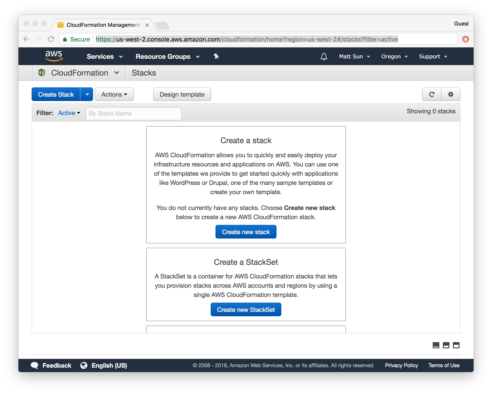
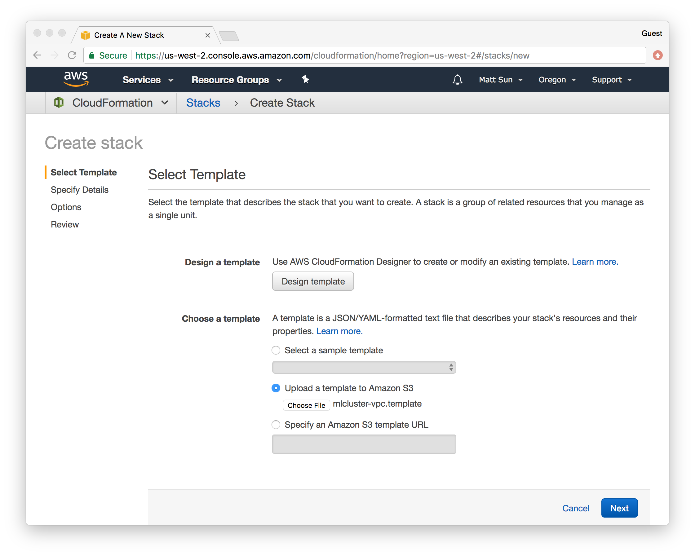
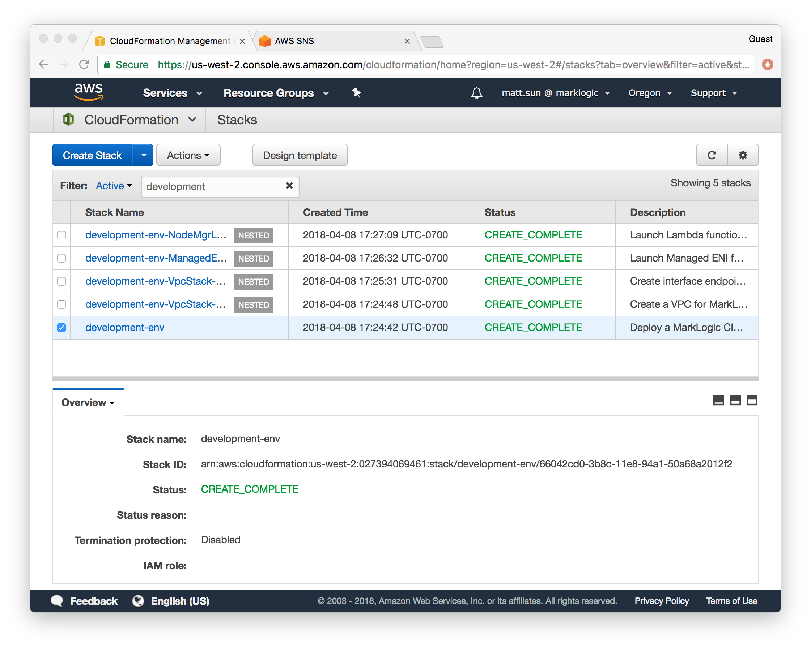

# Hands-on MarkLogic in the Cloud Workshop: Amazon Web Services (AWS)

## Unit 1 - Create the MarkLogic Cluster

In unit 1, we will create a three node MarkLogic cluster using CloudFormation templates on Amazon Web Services. For our purposes, a **node** is an Amazon EC2 server instance running MarkLogic. A **cluster** is one or more MarkLogic nodes working together.

It's simple to create a MarkLogic cluster in Amazon Web Services. But before you do, you should become familiar with the process. It's highly recommended to read through the [MarkLogic Server on Amazon EC2 Guide](https://docs.marklogic.com/guide/ec2) .

An overview of the procedures follows with links to MarkLogic documentation.

Procedure                         | For Details See...
--------------------------------- | -----------------------
If you don’t already have an Amazon EC2 account, create one. | [Creating an Amazon EC2 Account](https://docs.marklogic.com/guide/ec2/GettingStarted#id_52961) 
Enable a MarkLogic Server AMI. | [Enabling a MarkLogic Server for EC2 AMI](https://docs.marklogic.com/guide/ec2/GettingStarted#id_99793)
Open the Amazon AWS Management Console. | [Accessing the AWS Management Console](https://docs.marklogic.com/guide/ec2/GettingStarted#id_69008)
Create an IAM role. | [Creating an IAM Role](https://docs.marklogic.com/guide/ec2/GettingStarted#id_39710)
If you don’t already have a key pair, create one. | [Creating a Key Pair](https://docs.marklogic.com/guide/ec2/GettingStarted#id_24571)
Create a Simple Notification Service (SNS) Topic. | [Creating a Simple Notification Service (SNS) Topic](https://docs.marklogic.com/guide/ec2/GettingStarted#id_69696)
Create CloudFormation stack from a CloudFormation template. | [Deploying MarkLogic on EC2 Using CloudFormation](https://docs.marklogic.com/guide/ec2/CloudFormation)
Open the MarkLogic Server Admin interface. | [Accessing a MarkLogic Server Instance](https://docs.marklogic.com/guide/ec2/managing#id_18558)

### Process to Create a MarkLogic Cluster using CloudFormation Templates

> Before starting, make sure you have done the following.  

> * You have created an IAM Role to use for your MarkLogic cluster.
> * You have created an EC2 Key-Pair to securely shell into your MarkLogic cluster.
> * You have created a Simple Notification System (SNS) topic to receive log messages from the MarkLogic cluster and copied the SNS topic's ARN. You will need the ARN when creating the cluster.

Let's begin.

### Enable a MarkLogic AMI

1. Go to <https://aws.amazon.com/marketplace> .
2. In the top search bar, leave the dropdown at the default setting of **AMI & SaaS** then enter the search term `marklogic`.
3. Click the Search icon or press the ENTER key to begin the search.
4. In the results, click on **MarkLogic Developer 9**.
  
5. Click the **Continue to Subscribe** button.
6. Click the **Service Catalog** tab.
7. Click the **Accept Software Terms** button.
  
8. You've now subscribed to the MarkLogic AMI and can proceed to use a CloudFormation template to create your running instance.

### Launch your cluster using a CloudFormation tempate.

1. Go to [CloudFormation page](https://us-west-2.console.aws.amazon.com/cloudformation/home?region=us-west-2#/stacks?filter=active) of AWS Web Console. (Log into the AWS Console, if needed.) You can change your region from the top right corner. For the purpose of this excercise, we are using US West 2.

2. Click the **Create new stack** button.
6. In the **Select Template** section, select the radio button "Upload a template to Amazon S3". Click the "Choose File" button and choose the template file `mlcluster-vpc.template` provided.

7. Click the **Next** button.

8. Fill in the following information.
	* AdminPass - the MarkLogic administrator user password. The user and password will be created when the cluster is created.
	* AdminUser - the MarkLogic administrator user name. The user and password will be created when the cluster is created.
	* IAMRole - a previously created Identity and Access Management role name. 
	* InstanceType - the desired EC2 instance type.
	* KeyName - a previously created EC2 Key-Pair name.
	* Licensee - leave blank to use the included Developer's License.
	* LicenseKey - leave blank.
	* LogSNS - the ARN of a previously created Simple Notification System topic.
	* NodePerZone - the number of MarkLogic servers created per Availability Zone. Leave this at 1 to create a simple 3-node cluster.
	* SpotPrice - leave blank.
	* VolumeSize - leave at the default of 10 GB.
	* VolumeType - leave at the default.
	* Zone1, Zone2, Zone3 - select 3 different Availability Zones
9. Click the **Next** button.
10. On the **Options** page, create a tag with key as `Name` and value as your stack name specified in the previous page. Leave all other settings to the defaults, scroll to the bottom and click the **Next** button.

11. On the **Review** page, scroll to the bottom and check the box "I acknowledge that AWS CloudFormation might create IAM resources with custom names". This is to authorize CloudFormation to create IAM role based on the permissions specified in the template. Then click the **Create** button.

12. You are returned to the **Create Stack** page while your CloudFormation stack is being created.
13. After the stack is created, the page will refresh with the name of your completed stack.

14. When the Scroll down until you see **Outputs** as the second tab. Click on the **Outputs** tab.
15. The URL to access MarkLogic's Administrative Interface page on port 8001 is in the `Value` column. Copy this URL to use later.

## Check the Status of the New Instance

> Note: it takes approximately 10 to 15 minutes for the created MarkLogic server instances to pass their validation checks and initialize MarkLogic clusters.

1. Open another tab in your browser.
2. Go to the AWS Console page at <https://console.aws.amazon.com> .
3. In the **Compute** section, click on **EC2**.
4. On the left side, click on **Instances** in the **Instances** group.

5. In the list of EC2 instances, make sure the state is `started` in the **Instance State** column and the **Status Checks** column is `2/2 checks passed` with a green checkmark icon.
6. If the status passes both checks, the instance has started successfully.

## Access the Cluster

Use the URL in the CloudFormation stack's **Outputs** tab to navigate to MarkLogic's Admin Interface.  

If you need to copy the URL again: 

* Navigate to the **CloudFormation** service by clicking on the **Services** link at the top of the AWS Console page. 
* Select your CloudFormation stack by clicking the checkbox. 
* Click the **Outputs** tab below the list of CloudFormation stacks for the URL.
