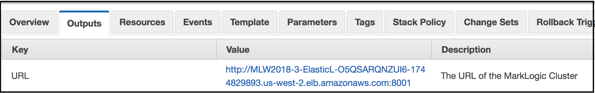

# Unit 2: Node Recovery
In this unit, we will explore how a MarkLogic cluster recovers from the loss of one of MarkLogic servers. 

## Table of Contents

1. [Terminate a MarkLogic Node Instance](#terminate)
2. [Verify Replacement Node](#verify)
3. [Access MarkLogic Cluster](#access)

The AWS Auto Scaling Group and Managed Cluster features ensure the health of the cluster. The EC2 Auto Scaling Group feature ensures the health of the MarkLogic cluster and terminates non-responsive MarkLogic instances. New instances replace the old ones. The replacement MarkLogic EC2 instances join the MarkLogic cluster and attach to the existing EBS volumes containing your data.

Amazon's Elastic Load Balancer sends periodic "heartbeat" messages to the MarkLogic server instances. The MarkLogic *HealthCheck* Application Server responds to these "heartbeats" so AWS knows when a MarkLogic server instance is non-responsive. When the instance stops responding, AWS' Managed Cluster feature terminates that instance. The AWS Auto Scaling Group starts another EC2 instance. The Managed Cluster feature ensures the new instance joins the MarkLogic cluster.

Data is not lost during this process. The new MarkLogic instance connects to the existing EBS volume when the new instance starts.

Let's take a look at the recovery process.

## Terminate a MarkLogic Node Instance
1. Access your AWS Console.
	* Go to <https://console.aws.amazon.com> and log in, if needed.
2. Under the **Compute** group, click the **EC2** link.  
	
3. In the **EC2 Dashboard**, note there are *"N" Running Instances*. There are many instances since we are all under one master account. Therefore, we all have at least 3 running instance for each person.
4. Click the **Running Instances** link.  
	
5. The table of instances is displayed. 
	* Each row has an empty checkbox in the first column. 
	* You can select and unselect each instance by clicking the checkbox to toggle between selected and unselected.
6. Filter the list of instances.
	* Type in your name or initials, depending on how you made your stack name unique in the Unit 1 exercise.
	* Press ENTER to filter by part of the stack name. 
7. Select the first instance in the table by clicking its checkbox.
8. Click the **Actions** dropdown button at the top of the instances table.
9. From the displayed menu, select the **Instance State** option then select the **Terminate** option.  
	
10. A **Terminate Instance** verification window displays. Click the **Yes, Terminate** button to confirm.  
	
11. The instance will begin the termination process.

## Verify Replacement Node
1. Click the **Refresh** icon at the top of the instances table, towards the right-hand side. 
2. The table will refresh. Periodically refresh the table until the old instance's **Instance State** is `terminated`.  

	> This will take a couple of minutes. Please be patient.
	
3. At the top of the web page, click the **Services** menu.
4. Under the **Compute** group, click the **EC2** link again.  
	
5. In the **EC2 Dashboard**, note there are *"N" Running Instances*. But there will be fewer than when you viewed your EC2 Dashboard originally as we all begin to terminate our first instance in our clusters.
	
6. Click the link for **Load Balancers** to view your Elastic Load Balancer.
7. On the Load Balancer page, filter the list of Load Balancers according to your name or initials. 
8. Select the Load Balancer from the table.
8. Scroll down and click the **Instances* tab to display the EC2 instances it is balancing.
	
9. Scroll the instance table a bit to display the names of your EC2 instances.
	
10. Refresh the table by clicking on the *Refresh* icon at the top of the **Load Balancer** page.
	
11. Refresh every few minutes. A new instance will start and appear in the table.
	
11. Continue to refresh every few minutes until the new instance changes **Status** to **InService**.
	

## Access MarkLogic Cluster
1. Click the **Services** icon at the top then select **CloudFormation** under the **Management Tools** group.  
	
2. Filter the list of CloudFormation stacks by typing in your name or initials then pressing ENTER.
3. Select the your CloudFormation Main Stack (not any *Nested* stack). 
4. Click the **Outputs** tab below the table of stack names.
	
5. The MarkLogic cluster is recovered and can be accessed again by its Elastic Load Balancer URL.

## Summary
When Amazon's Elastic Load Balancer doesn't get a response from MarkLogic's HealthCheck application server, the MarkLogic EC2 instance is terminated. The AWS Auto Scaling Group will start a new MarkLogic EC2 instance to ensure the number of nodes per zone value from the CloudFormation template is maintained. As part of the Managed Cluster feature, the new instance will re-attach to the EBS storage containing your configuration and content.

