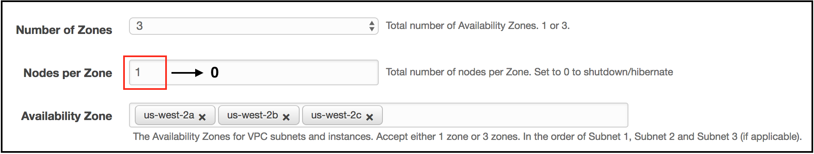

# Unit 3: Pausing and Resuming Clusters

MarkLogic test, development and QA clusters are often transient. Sometimes we need them and sometimes we don't. These clusters can be paused when not needed to minimize AWS costs associated with them. When needed, they can be easily resumed.

## Table of Contents
1. [Display your CloudFormation Stacks](#cf-stacks)
2. [Pause your CloudFormation Stack](#pause-stack)
3. [Verify your Data Volumes](#verify)
4. [Resume your CloudFormation Stack](#resume)

Let's take a look at the process of pausing and resuming a MarkLogic cluster.

## Display your CloudFormation Stacks
1.	Make sure that you are logged into the AWS Console.
2.	Click on **Services** at the top of the page.
3. In the **Management Tools** group, select **CloudFormation** to display your previously created CloudFormation stack.  
	

## Pause your CloudFormation Stack
1. Click the checkbox in the first column to select your MarkLogic CloudFormation stack.  
	
2. Click the **Options** dropdown then select **Update Stack**.  
	
3. On the **Select Template** page, click **Next** at the bottom of the page.  
	
4. On the **Specify Details** page, scroll down the **Parameters** until you see **Nodes per Zone**.
5. Update the **Nodes per Zone** value to `0`.
	
6. Click **Next** at the bottom of the page.
7. On the **Options** page, click the **Next** button at the bottom of the page.
8. On the **Review** page, check the box to acknowledge that CloudFormation might create custom IAM resources.
	 
9. Click the **Update** button at the bottom of the page.  
	
10. You are returned to the main **Stacks** page in the **CloudFormation** group. The **Status** column changes automatically as your updates are applied to your CloudFormation stack.
	

## Verify your Data Volumes
1. Click on **Services** at the top of the page.
2. In the **Compute** group, select **EC2** to display your EC2 Dashboard.
3. In the **Resources** section at the top of the EC2 Dashboard, 
4. Note there are `0` **Running Instances**.  
	
5. Click on **Volumes**.  
	
6. Note the 3 MarkLogic Data volumes that were intially created as part of your CloudFormation stack remain. These will be connected to new MarkLogic instances when you resume your CloudFormation stack.

## Resume your CloudFormation Stack
1. In the **Display your CloudFormation Stacks** section above, repeat steps 1 through 3 to display your CloudFormation stack.
2. To resume your stack, repeat steps 1 through 4 in the **Pause your CloudFormation Stack** section above.
3. Enter `1` for the **Nodes per Zone** parameter.
4. Continue with steps 6 through 10 in the **Pause your CloudFormation Stack** section.

## Summary
You can pause and resume MarkLogic clusters to save on EC2 instance costs and resources. This is useful for intermittent usage such as development, test and QA purposes. Using CloudFormation templates enable you to quickly pause, resume and scale up MarkLogic clusters.

## Quiz
1. AWS CloudFormation templates create:  
	1. MarkLogic EC2 instances.
	2. Elastic Block Storage (EBS) for MarkLogic data and configuration.
	3. An AWS Elastic Load Balancer that distributes requests to MarkLogic Evaluator Nodes (Application Servers).
	4. All of the above.
2. You can pause an EC2 instance but cannot pause an entire MarkLogic cluster. 
	1. True.
	2. False.
3. Healthy MarkLogic EC2 instances that are ready to be contacted display an Elastic Load Balancer status of:
	1. Ready.
	2. InRange.
	3. InService.
4. When viewing a CloudFormation stack, you'd select the main stack to:
	1. Update the MarkLogic CloudFormation stack parameters.
	2. Get the URL for the MarkLogic Admininstrative Interface on port 8001.
	3. View the resources created such as the Elastic Load Balancer.
	4. All of the above.  

(Answers to Quiz)  
1) 4.  
2) 2.  
3) 3.  
4) 4.  
