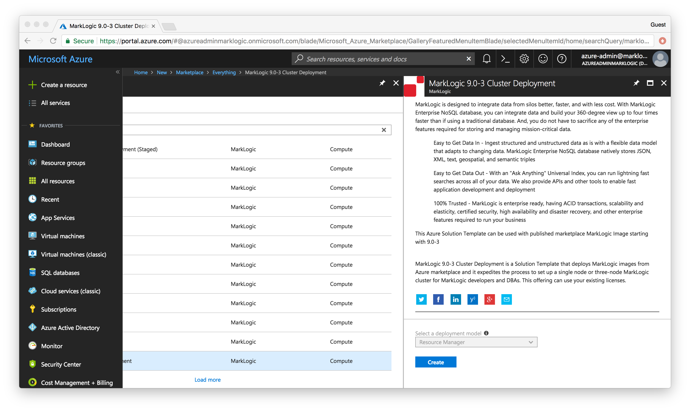
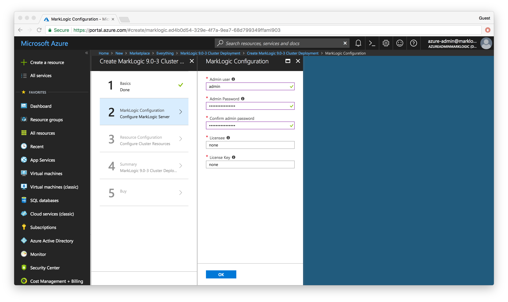
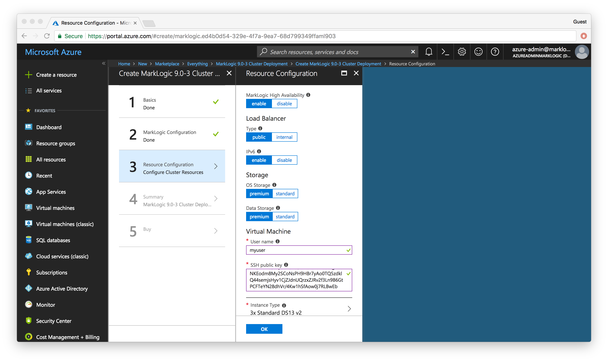
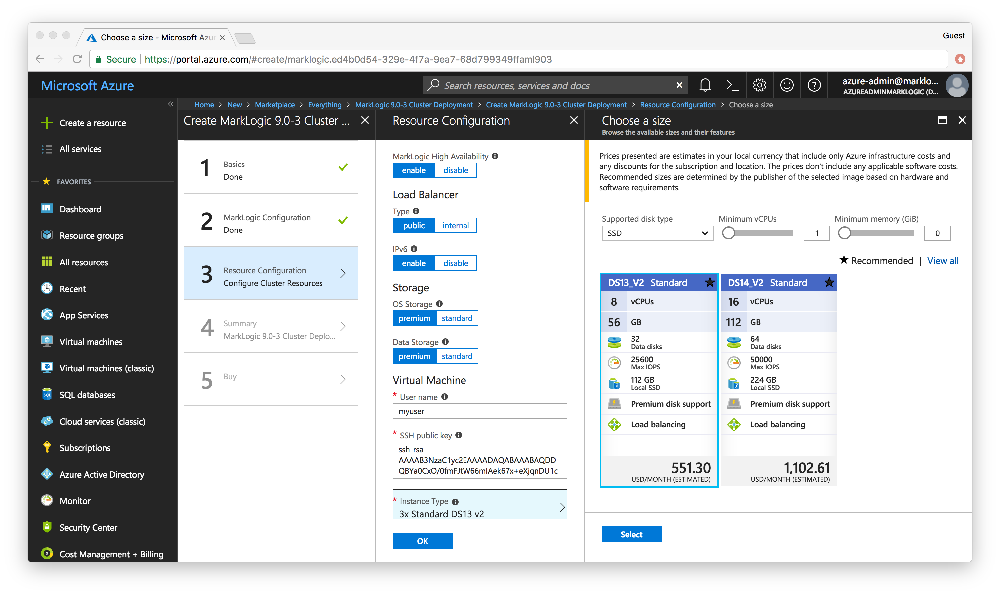
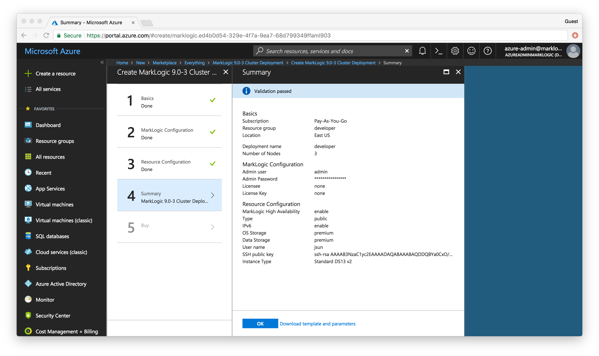
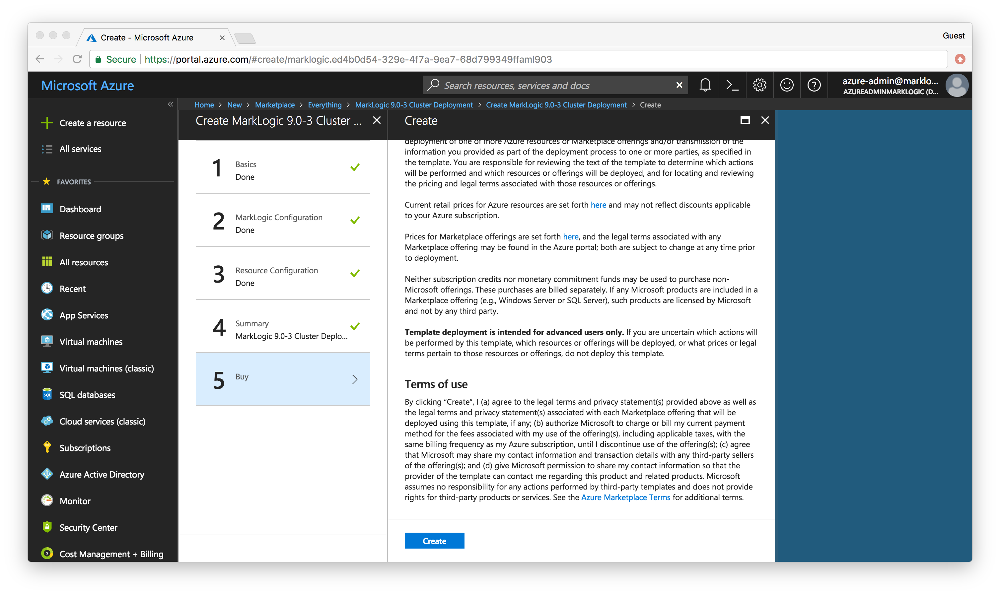

# Hands-on MarkLogic in the Cloud Workshop (Azure) Unit 1

Table of Contents:
- 
	- 
	- 
	- 
	- 
	- 

## Unit 1 - Create the MarkLogic Cluster

In unit 1, we will create a three node MarkLogic cluster using Solution Templates on Microsoft Azure. For our purposes, a **node** is an Azure VM instance running MarkLogic. A **cluster** is one or more MarkLogic nodes working together.

It's simple to create a MarkLogic cluster in Microsoft Azure. But before you do, you should become familiar with the process. It's highly recommended to read through the [MarkLogic Server on Microsoft® Azure® Guide](http://docs.marklogic.com/guide/azure) .

### Process to Create a MarkLogic Cluster using Azure Solution Template

Before starting, make sure you have done the following.  

* If you don’t already have an Microsoft account, create one. [Creating you Azure free account today](https://azure.microsoft.com/en-us/free/)
* Access Azure portal. [Create and share dashboards in the Azure portal.](https://docs.microsoft.com/en-us/azure/azure-portal/azure-portal-dashboards)
* Create a subscription.

Let's begin.

### Launch your cluster using an Azure Solution Tempate

1. Go to [Microsoft Azure Portal](https://portal.azure.com/). Log into the Microsoft account, if needed.
2. Create button "Create a resource" button on the left tab bar.
3. In the search text box. Press the ENTER key to begin the search

4. From the search result list, select MarkLogic 9.0-4 Cluster Deployment.

5. Click "create" button to enter the interactive guide for cluster deployment.
6. In the basic configuration page, fill in the following information. Then click "OK" to move on to next step.
	* Deployment name - "developer".
	* Number of Nodes - We will use the default value 3 for this excercise.
	* Subscription - Select a subscription which the running resources will be billed to.
	* Resource group - "developer". We will create a new one for this excercise.
	* Location - "East US". You can change the region from the dropdown. For this exercise, we will use US east.

7. In the MarkLogic configuration page, fill in the following information. Then click "OK" to move on to next step.
	* Admin user - 
	* Admin password - 
	* Confirm admin password - 
	* Licensee - 'none'. MarkLogic licensee if you already have one. For this excercise, we will use free license.
	* License Key - 'none'. MarkLogic license key if you already have one. For this excercise, we will use free license.

8. In the resource configuration page, fill in the following information.
	* MarkLogic High Availability - 'enable'. Default value.
	* Load Balancer: Type - 
	* Load balancer: IPv6 - 
	* Storage: OS Storage - 
	* Storage: Data Storage -
	* Virtual machine: Username - 
	* Virtual machine: SSH public key - 

9. Click the "Instance Type" button to pop up the Instance Size Selector. Select a size for VM instance. For this exercise, we will use default value "3x Standard DS13 v2". Click "Select" button and "OK" button on the "Resource Configuration" page.

10. The summary of the cluster configuration will show. Click "OK" to confirm. If you want to modify some settings, click the corresponding tag on the left (Basics, MarkLogic Configuration, Resource Configuration) to go back.

11. On the "Buy" page, scroll down to bottom and click "Create" to accept the terms and deploy the stack.

