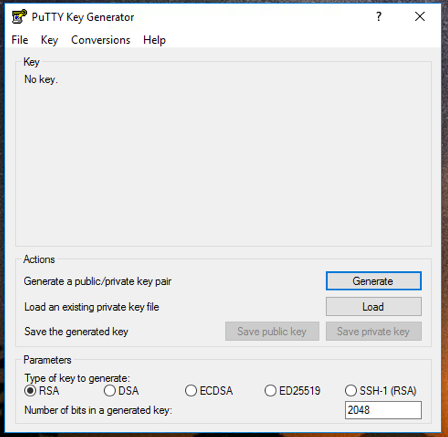
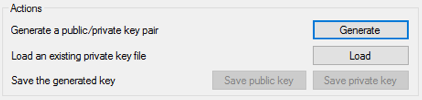
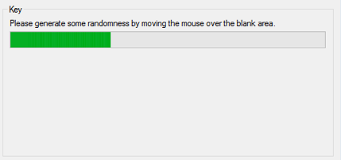
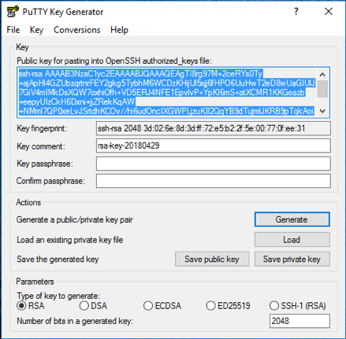
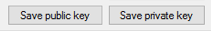
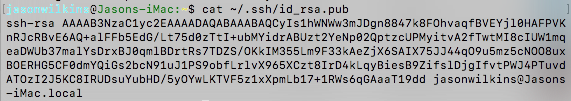

# Azure Workshop Preparation

It's simple to create a MarkLogic cluster in Microsoft Azure. But before you do, you should become familiar with the process. It's highly recommended to read through the [MarkLogic Server on Microsoft® Azure® Guide](http://docs.marklogic.com/guide/azure).

Also, make sure you have done the following:  

* If you don’t already have a Microsoft account, create one.  
[Creating you Azure free account today](https://azure.microsoft.com/en-us/free/)
* Access the *Azure portal*.  
[Create and share dashboards in the Azure portal.](https://docs.microsoft.com/en-us/azure/azure-portal/azure-portal-dashboards)
* Create an account subscription that running resources can be billed to.
* Ensure you have [Putty](https://www.chiark.greenend.org.uk/~sgtatham/putty/latest.html) if you are using Windows.  MacOS and other \*nix users already have SSH in their terminal.
* An SSH key is required for this workshop.  A placeholder one will be supplied, but outside of the workshop you would need to have your own generated. See the following sections for more details.

# Creating a public SSH key (OPTIONAL)
## Creating a public SSH key (on Windows)
To create the public SSH key on Windows, we are going to assume that you have already installed the [Putty suite](https://www.chiark.greenend.org.uk/~sgtatham/putty/latest.html) which includes the *PuTTYgen* utility.

1. Launch the *PuTTYgen* utility.  
  
2. Click the **Generate** button.  
  
3. Wiggle the mouse around inside the blank space in the application window to create some randomness.  
  
4. Once the application has collected enough input, the key pair will be generated.  
  
5. Click on the **Save public key** and the **Save private key** buttons in turn to save both the public and private keys that were generated.  Please remember where these are stored as the public key will be needed for [Unit 1](../unit1-deploy-cluster/README.md).  
  

## Checking for an SSH key (on MacOS)
1. Open a command *Terminal*.
2. Try to list the contents of your public SSH key, if it exists.  
`cat ~/.ssh/id_rsa.pub`  
  

> If the return is `No such file or directory`, then you need to generate a public key.  Otherwise, make a note of it as we will need it in [Unit 1](../unit1-deploy-cluster/README.md).

## Creating a public SSH key (on MacOS and most \*nix)

1. Open a command *Terminal*.
2. Issue the following command:  
`ssh-keygen -t rsa`
3. Press **Enter** to accept the default location, but make note of where it is for your OS.
4. If desired type in a passphrase and press the **Enter** key. You can also just press the **Enter** key to accept the default (no passphrase). While easier to remember, from a security perspective it is not advised to leave this blank.
5. Confirm the passphrase as entered in the previous step.

> At this point the SSH key should be generated and available.  Follow the instructions in the previous section, [Checking for an SSH key (on MacOS)](#sshOnMax), and use the directory that was listed in step 3.