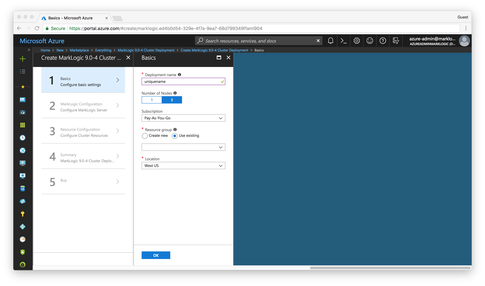
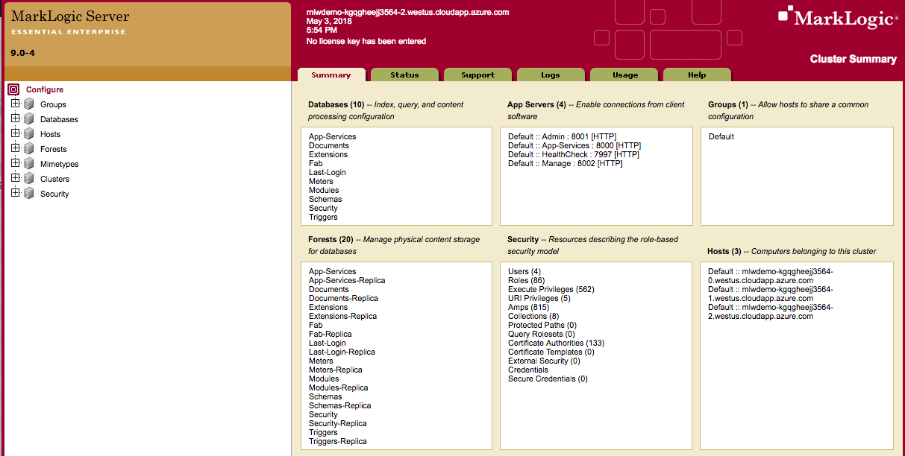

# Hands-on MarkLogic in the Cloud Workshop (Azure) Unit 1

Table of Contents:
- [Unit 1 - Create the MarkLogic Cluster](#unit1)
	- [Process to Create a MarkLogic Cluster using Azure Solution Template](#process)
	- [Launch your cluster using an Azure Solution Tempate](#launch)
	- [Check the Status of the New Cluster](#cluster)
	- [Access the Cluster](#access)
	- [Optional Exercise](#optional)

## Unit 1 - Create the MarkLogic Cluster

In unit 1, we will create a three node MarkLogic cluster using Solution Templates on Microsoft Azure. For our purposes, a **node** is an Azure VM instance running MarkLogic. A **cluster** is one or more MarkLogic nodes working together.

It's simple to create a MarkLogic cluster in Microsoft Azure. But before you do, you should become familiar with the process. It's highly recommended to read through the [MarkLogic Server on Microsoft® Azure® Guide](http://docs.marklogic.com/guide/azure) .

### Process to Create a MarkLogic Cluster using Azure Solution Template

Before starting, make sure you have done the following.  

* If you don’t already have an Microsoft account, create one. [Creating you Azure free account today].(https://azure.microsoft.com/en-us/free/)
* Access Azure portal. [Create and share dashboards in the Azure portal.](https://docs.microsoft.com/en-us/azure/azure-portal/azure-portal-dashboards)
* Create a account subscription that running resources will be billed to.

Let's begin.

### Launch your cluster using an Azure Solution Tempate

1. Go to [Microsoft Azure Portal](https://portal.azure.com/). Log into the Microsoft account, if needed.
2. Create button "Create a resource" button on the left tab bar.
3. In the search text box. Press the ENTER key to begin the search

4. From the search result list, select MarkLogic 9.0-4 Cluster Deployment.

5. Click "create" button to enter the interactive guide for cluster deployment. 
6. In the basic configuration page, fill in the following information. Then click "OK" to move on to next step.
	* Deployment name - a unique string that will be used as resources prefix. Example: **mlwdemo**.
	* Number of Nodes - leave at the default of **3** nodes.
	* Subscription - select a subscription which the running resources will be billed to.
	* Resource group - use existing and select a resource group from the dropdown menu.
	* Location - You can change the region from the dropdown. For this exercise, we will use **US West**.

7. In the MarkLogic configuration page, fill in the following information. Then click "OK" to move on to next step.
	* Admin user - the MarkLogic administrator user name. The user and password will be created when the cluster is created.
	* Admin password - the MarkLogic administrator user password. The user and password will be created when the cluster is created. The Password must be 12-40 characters long and contain at least one uppercase letter, digit and special character `.!@#$%^&()-_=+`
	* Confirm admin password - confirm the admin password.
	* Licensee - leave at the default value **none** to use the included Developer's License.
	* License Key - leave at the default value **none** to use the included Developer's License.

8. In the resource configuration page, fill in the following information.
	* MarkLogic High Availability - leave at the default of **enable**.
	* Load Balancer: Type - leave at the default of **public**.
	* Load balancer: IPv6 - leave at the default of **enable**.
	* Storage: OS Storage - Select **premium** for this exercise.
	* Storage: Data Storage - Select **premium** for this exercise.
	* Virtual machine: Username - 
	* Virtual machine: SSH public key - 

9. Click the "Instance Type" button to pop up the Instance Size Selector. Select a size for VM instance. For this exercise, we will use default value "3x Standard DS13 v2". Click "Select" button and "OK" button on the "Resource Configuration" page.

10. The summary of the cluster configuration will show. Click "OK" to confirm. If you want to modify some settings, click the corresponding tag on the left (Basics, MarkLogic Configuration, Resource Configuration) to go back.

11. On the "Buy" page, scroll down to bottom and click "Create" to accept the terms and deploy the stack.

### Check the Status of the New Cluster

> Note: it takes approximately 10 to 15 minutes for the created MarkLogic server instances to start up and initialize MarkLogic Servers.

1. Go to Resour Groups by click on the **Resource Groups** button on the left tab bar.
2. Select the resource group we just created.
3. From the resource group view, we will see the deployment status and list of successfully created resources.

4. Once it shows all deployment are finished and successful, the cluster is ready to use.

### Access the Cluster

1. Go to Resour Groups by click on the **Resource Groups** button on the left tab bar.
2. Select the resource group we just created.
3. Select the load balancer's public IPv4 address from the resource list. In this excercise, it's called "mlwdemo-lbIp-v4".
4. From the Public IP address view, copy the **DNS Name** value in overview. We will use this address to access the cluster.

5. Open another tab in the browser, go to the port 80001 of the above address. Enter the Admin user name and password set for the cluster when we create the deployment configuration.
6. You will see MarkLogic administration interface show up.

### Optional Exercise

Once you go through the basic flow of deploying a cluster, you can also customize the cluster by using different deployment type.

- In [Step 6 of Launch](#step6), select **1** node to be deployed as a cluster.
- In [Step 8 of Launch](#step8), you only need to configure fewer parameters for the single node cluster.
- Follow [Step 9 of Launch](#step9) and subsequent steps to finish deployment.

Now you should see a new one node cluster is coming up!
