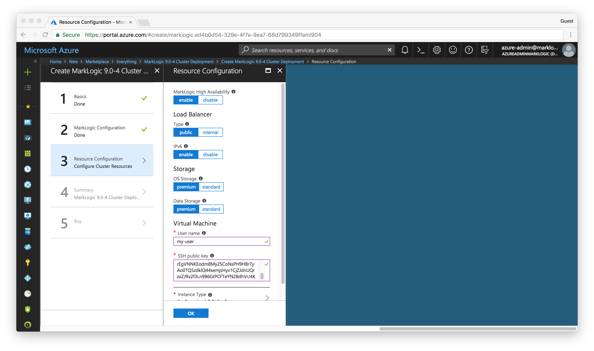
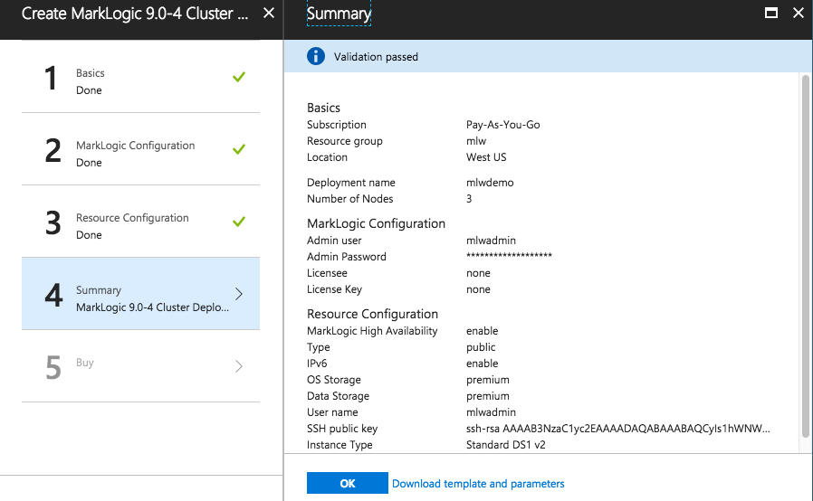

# Unit 1: Create the MarkLogic Cluster

In Unit 1, we will create a three node MarkLogic cluster using Solution Templates on Microsoft Azure. For our purposes, a node is an Azure VM instance running MarkLogic. A *cluster* is one or more MarkLogic nodes working together.

It's easy to create a MarkLogic cluster in Microsoft Azure. But before you do, you should become familiar with the process. It's highly recommended to read through the [MarkLogic Server on Microsoft® Azure® Guide](http://docs.marklogic.com/guide/azure).

## Table of Contents

- [Process to Create a MarkLogic Cluster using Azure Solution Template](#process)
- [Launch your cluster using an Azure Solution Tempate](#launch)
- [Check the Status of the New Cluster](#cluster)
- [Access the Cluster](#access)
- [Optional Exercise](#optional)

## Preparation (ALREADY COMPLETED)

Before starting, make sure you have done the following:  

* If you don’t already have a Microsoft account, create one.  
[Creating you Azure free account today](https://azure.microsoft.com/en-us/free/)
* Access the *Azure portal*.  
[Create and share dashboards in the Azure portal.](https://docs.microsoft.com/en-us/azure/azure-portal/azure-portal-dashboards)
* Create an account subscription that running resources will be billed to.

Let's begin.

## Launch your cluster using an Azure Solution Template

1. Go to the [Microsoft Azure Portal](https://portal.azure.com/). Log into your Microsoft account, if needed.
2. Click the **Create a resource** button on the left tab bar.
3. Type `marklogic` in the search text box. Press the **Enter** key to begin the search.

4. From the search result list, select `MarkLogic 9.0-4 Cluster Deployment`.

5. Click the **Create** button to enter the interactive guide for cluster deployment. 
6.  In the *Basics* configuration page, fill in the following information: 
	* **Deployment name** - a unique string that will be used as the resources' prefix. Example: `mlwdemo`
	* **Number of Nodes** - leave at the default of `3` nodes
	* **Subscription** - select a subscription which the running resources will be billed to
	* **Resource group** - `Use existing` and select a resource group from the dropdown menu.
	* **Location** - You can change the region from the dropdown. For this exercise, we will use `West US`.

7. Then click the **OK** to move on to next step.
7. In the *MarkLogic Configuration* page, fill in the following information:
	* **Admin user** - The MarkLogic administrator user name. The user and password will be created when the cluster is created.  We will use `mlwadmin` for the administrator name.
	* **Admin password** - the MarkLogic administrator user password. The user and password will be created when the cluster is created. The Password must be 12-40 characters long and contain at least one uppercase letter, digit and special character `.!@#$%^&()-_=+`. We will use `MarkLogicWorld_2018` as the password.
	* **Confirm admin password** - confirm the admin password
	* **Licensee** - Leave it with the default value `none` to use the included Developer's License.  See the [Developer License page](https://developer.marklogic.com/free-developer) for more details.
	* **License Key** - Leave it with the default value `none` to use the included Developer's License.

8. Then click the **OK** button to move on to next step.
8.  In the *Resource Configuration* page, fill in the following information:
	* **MarkLogic High Availability** - leave at the default of `enable` (This feature only provides high availability for the resources created as part of the normal initialization of MarkLogic.  You would be responsible for configuring any new databases and forests.  Please refer to the [Scalability, Availability, and Failover Guide](http://docs.marklogic.com/guide/cluster) for more details.)
	* **Load Balancer: Type** - leave at the default of `public`
	* **Load Balancer: IPv6** - leave at the default of `enable`
	* **Storage: OS Storage** - Select `premium` for this exercise
	* **Storage: Data Storage** - Select `premium` for this exercise
	* **Virtual machine: Username** -  `mlwadmin`
	* **Virtual machine: SSH public key** - Use the value provided by your instructor.

9. Still on the *Resource Configuration* page, click the **Instance Type** control to pop up the *Choose a size* page. Select a size for VM instance. For this exercise, we will use default value `DS1 v2`. Please note we are choosing this option as this we will not be doing any processing.  For more details on installation requirements, please refer to the [Installation Guide](http://docs.marklogic.com/guide/installation).  Click the **Select** button. 

10. Click the **OK** button on the *Resource Configuration* page.
10. The *Summary* of the cluster configuration will show. If you want to modify some settings, click the corresponding tab to the left (*Basics*, *MarkLogic Configuration*, *Resource Configuration*) to go back. Click the **OK** button to confirm. 

11. On the *Buy* page, scroll down to bottom and click the **Create** button to accept the terms and deploy the stack.

## Check the Status of the New Cluster

> Note: It takes approximately 10 to 15 minutes for the created instances to start up and to initialize the MarkLogic Servers.

1. Go to *Resource Groups* by click on the **Resource Groups** button on the left tab bar.
2. Select the resource group we used while [launching the cluster](#step6).
3. From the *Resource group* view, we will see the deployment status and a list of successfully created resources.

4. Once it shows all deployments are finished and successful, the cluster is ready to use.

## Access the Cluster

1. Go to *Resource Groups* by click on the **Resource groups** button on the left tab bar.
2. Select the resource group we just created.
3. Click on the load balancer's public IPv4 address from the resource list. For example, it could be `mlwdemo-lbIp-v4`.
4. From the *Public IP address* view, copy the **DNS Name** value. We will use this address to access the cluster.

5. Open another tab in the browser and go to the port 8001 of the above address. For example `mlwdemo-kgqgheejj3564-lb.westus.cloudapp.azure.com:8001`.
6. Enter the Admin user name and password set for the cluster when we specified the [deployment configuration](#step8).
6. You will see the MarkLogic *Admin Interface* show up.

## Optional Exercise

Once you go through the basic flow of deploying a cluster, you can also try to customize the cluster by using different deployment options.

- In [Step 6 of Launch](#step6), select **1** node to be deployed as a cluster.
- In [Step 8 of Launch](#step8), there are fewer parameters to configure for the single node cluster.
- Follow [Step 10 of Launch](#step10) and subsequent steps to finish deployment.

Now you should see a new one node cluster is coming up!
