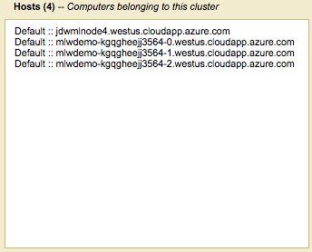

# Unit 2: Cluster Scale Up
In this unit, we will explore how to add another node to an existing MarkLogic cluster. Realize that adding a single node to a three-node cluster would not be ideal.  In reality, the cluster should be an odd number of nodes for purposes of high availability.  For more details see the [Scalability, Availability, and Failover Guide](http://docs.marklogic.com/guide/cluster).

## Table of Contents
1. [Creating the Node](#creatingTheNode)
2. [Adding the Node to the Cluster](#addingNode)
3. [Summary](#summary)

## Creating the Node
01. Starting from the [*Azure Dashboard*](https://portal.azure.com), launch the *Marketplace*.  

9. Search for `MarkLogic`
09. From the list you can choose between developer or bring your own license.  For this demonstration we will choose 9.0-4 Developer to match the version was selected in Unit 1.  

10. At the bottom of the description screen on the right, click the **Create** button
11. Fill in the following details in the *Basics* panel.
	* **Name** - `mlNode4`
	* **VM disk type** - `SSD` 
	* **User name** - `mlwadmin`
	* **Authentication type** - `Password`	* **Password** - `MarkLogicWorld_2018`
	* **Resource group** - `Use existing` and match what was used in [Unit 1](../unit1-deploy-cluster/README.md#step6)
	* **Location** - Match what was used in [Unit 1](../unit1-deploy-cluster/README.md#step6)
12. Click the **OK** button on the *Basics* panel.
15. For the *Size* panel, we need to choose an appropriate configuration that has at least 4 cores & 2GB of memory.  For more details on installation requirements, please refer to the [Installation Guide](http://docs.marklogic.com/guide/installation).
	* Minimum vCPUs - 4
	* Minimum memory (GiB) - 2
	* Select **View all**
16. Choose the **D4S_V3 Standard** configuration and click the **select** button.  

17. In the *Settings* panel, double check that the **Virtual network** is set to `RESOURCEGROUP-vnet` and change the **Network security group** to `RESOURCEGROUP-nsg`.  
  
18. Click the **OK** button on the *Settings* panel.
17. Verify that `MarkLogic Developer 9` is listed in the **Summary** pane and click the **Create** button.
18. Wait for deployment to finish (watch the bell icon above the dashboard).  The machine's **Overview** should appear automatically.  But, if needed the machine should appear in Virtual Machine list on the left. 
19. Find the **Public IP address** and click on it.
20. Set the **DNS name label** to your initials and mlNode3 to create a unique name.  For example `jdwmlnode4`.  

21. Click **Save** at the top to apply and save the new setting.
22. Make a note of the **DNS name label** you used, and the rest of the path that is listed just below it.  For example `.westus.cloudapp.azure.com`.

## Adding the Node to the Cluster
1. Use the full DNS name of our new node to bring up the admin interface on port 8001.
22. Go ahead and initialize the node by clicking the **OK** button.
22. Once the basic initialization has occurred, we need to add our new node into the cluster.  Use the full DNS name for one of the nodes created in Unit 1 for the **Host Name**.  This can be found using the *Azure Dashboard*.  
*Azure Dashboard* > *All resources* > *developer-ipv4-node0*, copy the **DNS name**  
 
23. After you have entered the **Host Name**, click the **ok** button.  

24. You may now be prompted for credentials.  Supply the credentials that were created in *Unit 1*.  

23. Set the *Host Name* to be the full DNS name of our new node.  For example, `jdwmlnode4.eastus.cloudapp.azure.com`.  We will leave the **Zone** empty.
24. Click the **ok** button.
24. Yes, we are sure we want to join the cluster so click the **ok** button to proceed.
24. The next screen alerts us that the cluster configuration will be transferred to the new host.  Click the **ok** button.
25. Switch to the *Summary* tab in the *Admin Interface*, and you should now see your new node listed in the **Hosts** panel.  

## Summary
Adding a node to a cluster on the Azure platform is little different from adding one in your local machine room.
