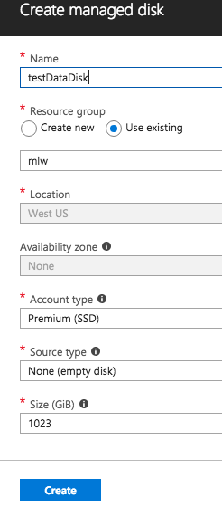
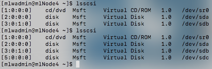

# Unit 3: Cluster Recovery (Optional)

For this optional Unit, we will be needing to SSH into our virtual machines.  If you are running *nix of some flavor or MacOS, you already have SSH available in your terminal.  Otherwise, you may need to obtain an SSH utility such as [putty](https://www.putty.org/).  There are also browser plugins, and even [thin clients](https://tools.bartlweb.net/webssh/) available.

The goal for this unit is to demonstrate how a data drive can be used even after the originating node is unavailable.

## Table of Contents
1. [View Existing Disk List](#viewExitingList)
2. [Add a Data Disk](#addDataDisk)
3. [Initialize the new Data Disk](#initializeDataDisk)
4. [Use the Data Disk](#useDataDisk)
5. [Reuse the Data Disk](#reuseDataDisk)
6. [Verify the Content](#verifyDataDisk)
7. [Summary](#summary)
8. [Quiz](#quiz)

## View Existing Disk List
1. To start with, we'll need to know the full DNS name of our virtual machine.  Starting from the *Azure Dashboard*, select *mlNode4*  

2. Copy the **DNS name** to the clipboard using the button that appears to the right of the **DNS name** when you hover over it.  

3. Now, use that DNS name to SSH into the machine, using the credentials we created in Unit 2.  For example, `ssh mlwadmin@jdwmlnode3.westus.cloudapp.azure.com`
4. Run the command `lsscsi` and make note of the current drives available.  
 
5. Leave the terminal open.

## Add a Data Disk
1. Starting from the *Azure Dashboard*, select **mlNode4**
2. Under *Settings*, click on *Disks*.
3. Click the **+ Add data disk** button.  

4. From the *NAME* drop-down, select `Create disk`.  

5. In the *Create managed disk* panel enter the following details:
	* Name - testDataDisk
	* Resource group - Use existing, selecting what was specified in Unit 1.  

6. Click the **Create** button.
7. Once the disk has been created, which may take a couple minutes, you will be returned to the list of disks for your virtual machine.  Click **Save** to update the VM configuration.
   * ==NOTE: Wait for the update to complete before proceeding==

## Initialize the new Data Disk 
In order to use the new disk, the partition table has to be updated, the file system type has to be specified, and the partition mounted.  You can either run a single command line, or you can do it step-by-step.

###OPTION 1 - Single command ###
1. If needed, SSH into the virtual machine once again.
2. Run the following command, you should only be prompted for the password once:

~~~
sudo parted /dev/sdc mklabel msdos -a optimal mkpart primary xfs 0% 100%; sudo mkfs -t xfs /dev/sdc1; sudo mkdir /datadrive; sudo mount /dev/sdc1 /datadrive; sudo chmod go+w /datadrive
~~~  

###OPTION 2 - Step by step ###
1. If needed, SSH into the virtual machine once again.
2. Run the command `lsscsi` and compare that to what was listed last time.  The new drive is the one we added.  For example it may be `/dev/sdc`.  

3. We need to add it as a device so use the `parted` command with the newly added disk.  For example, `sudo parted /dev/sdc mklabel msdos -a optimal mkpart primary xfs 0% 100%`.
7. Next we need to set the file system for the new partition using the `mkfs` command.  For example, `sudo mkfs -t xfs /dev/sdc1`
8. Now, we'll create a directory to mount the new files system to. `sudo mkdir /datadrive`
9. At this point we can mount the drive to make use of it. `sudo mount /dev/sdc1 /datadrive`
10. With the drive mounted, now we can make it writable with `sudo chmod go+w /datadrive`.
14. Leave the terminal open.

### OPTIONAL - Update fstab ###
To make sure the drive is remounted after a reboot it needs to be added to the /etc/fstab file. We don't plan on rebooting during this workshop so it is optional.

1.  We'll reference the partition using its UUID.  To find the UUID run `sudo -i blkid` and look for our new drive.  Copy and paste it somewhere accessible.
11. Now to add it to the fstab file.  This is a protected file, so we'll need to edit it using sudo. `sudo vi /etc/fstab`
12. Arrow to the last character in the file and press `a` to begin appending.  Add a new line for our drive, `UUID=cbb41429-7b8e-48ad-a638-a297abd6d99b /datadrive              ext4    defaults        1 2`, ensuring to set the UUID to what you noted previously.
13. Press the escape key, followed by `:wq`, and then hit enter. (this is performing a write-quit)

## Use the Data Disk
1. Use the full DNS name to bring up the *Query Console* on port 8000.
2. Import the `MLU-workshop-Azure.xml` workspace from the MLW\_2018\_Cloud_Workshop [GitHub repository](https://github.com/MarkLogicUniversity/MLW_2018_Cloud_Workshop/blob/master/Azure/unit3-node-recovery/MLU-workshop-Azure.xml).  

2. Select the *Set the stage* tab.  Notice that the forest is being created in the `/datadrive/` directory.
3. Click the **Run** button.  Once complete it will return `Setup Successfully Created`.  

4. Select the *Create content* tab.  This code will randomly generate 30 documents in the database.
5. Click the **Run** button. Once complete it will return `your query returned an empty sequence`.  

6. Verify that the content has been created by selecting the `mlu-workshop-azure` database and clicking the **Explore** button.  

7. OPTIONAL - You can also verify that content has been created by looking for a stand in the forest on the drive.  In the SSH terminal run the command `ls /datadrive/Forests/mlu-workshop-azure-Forest/` and verify that there is a directory called `00000000`.  

## Reuse the Data Disk
###Delete the current virtual machine###
 
1. Starting from the *Azure Dashboard*, select **mlNode4**
2. Click the **Delete** button, and confirm by clicking the **Yes** button.  The delete process will take a few minutes.  

> At this point the virtual machine called mlNode4 has been deleted.  But, the managed drive that we created *testDataDisk*, still exists and we want to use it again.

###Create a new virtual machine###
1. Follow the steps in [Unit 2 - Creating the Node](../unit2-cluster-scale-up/README.md#toc_1) to create the mlNode4 virtual machine again, except set the *DNS name label* to be node4new.  For example, `jdwmlnode4new`. For our purposes there is no need to add the node back into the cluster.

###Attach the existing disk###
3. From the *Azure Dashboard* select **mlNode4**.
4. Under *Settings* click on *Disks*.
3. Click the **+ Add data disk** button.
4. From the *NAME* drop-down, select the `testDataDisk`. Note that this is only available now that the original node it was associated with has been deleted and is no longer using it.  

5. Click **Save** to update the VM configuration.
   * ==NOTE: Wait for the update to complete before proceeding== 
6. SSH into the new node.  If you get a *Host key verification failed* message, you can run `ssh-keygen -R hostname` to clear it.

###OPTION 1 - Single command###
2. Run the following command, you should only be prompted for the password once:

~~~
sudo mkdir /datadrive; sudo mount /dev/sdc1 /datadrive; sudo chmod go+w /datadrive
~~~

###OPTION 2 - Step by step###
7. First, we'll create a directory to mount the new files system to. `sudo mkdir /datadrive`
9. At this point we can mount the drive to make use of it. `sudo mount /dev/sdc1 /datadrive`
10. You can verify that the forest data is now availble on this vm. `ls /datadrive/Forests/`
11. 10. With the drive mounted, now we can make it writable with `sudo chmod go+w /datadrive`.

##Verify the content##
1. Use the full DNS name to bring up the query console on port 8000.
2. Once again, import the `MLU-workshop-Azure.xml` workspace.
2. Select the *Set the stage* tab.  Notice that the forest is being created in the `/datadrive/` (which already has content there).
3. Click the **Run** button.
	* ==Do not run the *Create content* tab.  You should be reusing the content that was previously stored on the disk.==
4. Refresh the query console.
5. Select the `mlu-workshop-azure` database and click the **Explore** button.  You should see 30 documents listed.

## Summary
By establishing our forests on a separate data disk, we can isolate them from the rest of the VM and still potentially make use of them if a VM goes down or is removed.

## Quiz